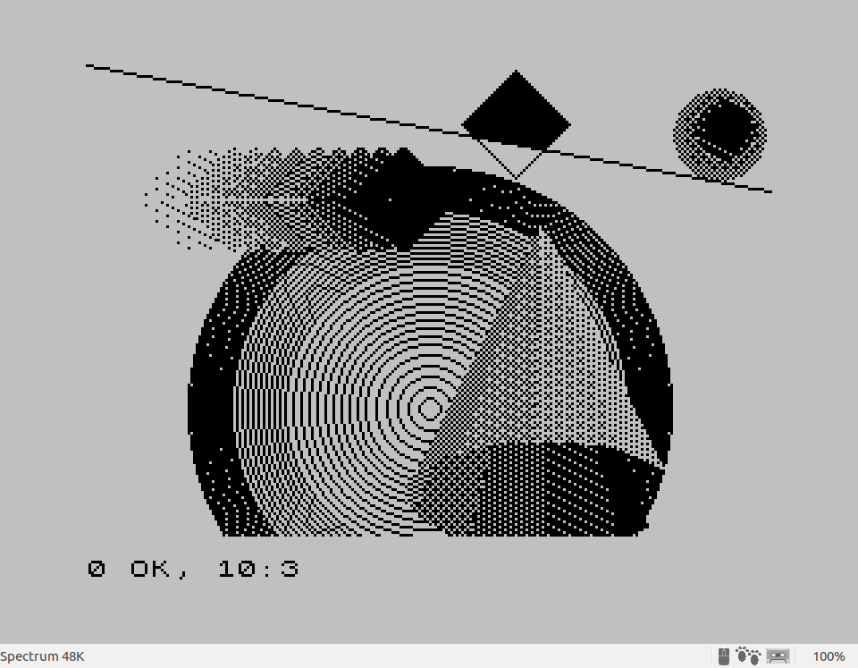

# Example C program with graphics and math libraries for z88dk

### 1. Compiling and taping the source file:

```shell
$ zcc +zx -lm -lndos -create-app -o gfx gfx.c
```

This will create the next files:

- a.tap
- a.bin
- a.BANK_7.bin

### 2. Load the .tap file generated in FUSE

It can be loaded as usual in FUSE and see how it runs.

If everything went well, we can see how the following image is drawn:


