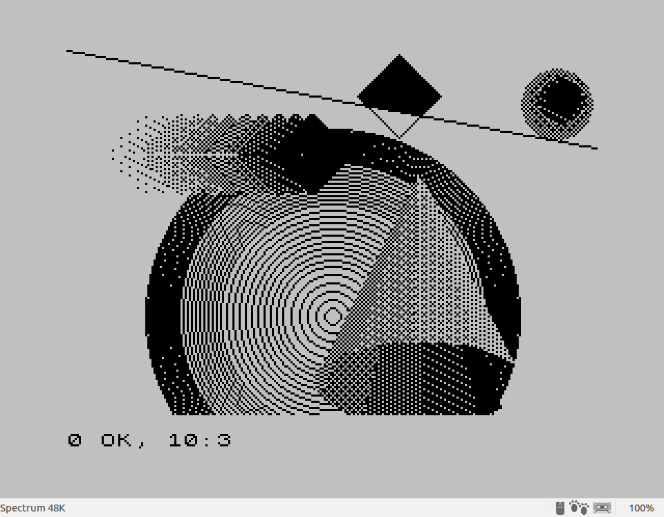

# Ejemplo de programa en C con gráficos y librerías matemáticas para z88dk

### 1. Compilamos y tapeamos el fichero fuente:

```shell
$ zcc +zx -lm -lndos -create-app gfx.c
```

Esto creará los siguientes ficheros:

- a.tap
- a.bin
- a.BANK_7.bin

### 2. Cargar el fichero .tap generado en el Fuse

Se puede cargar de la forma habitual en FUSE y ver como se ejecuta.

Si todo ha ido bien, podremos ver como se va dibujando la siguiente imagen:


